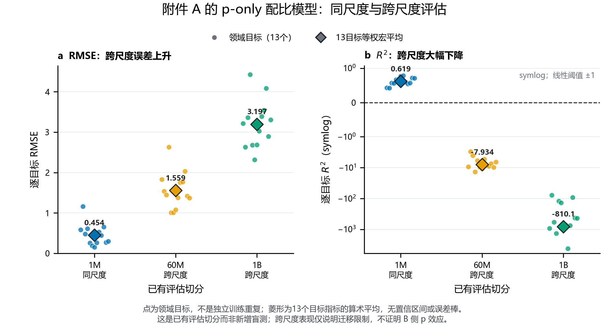
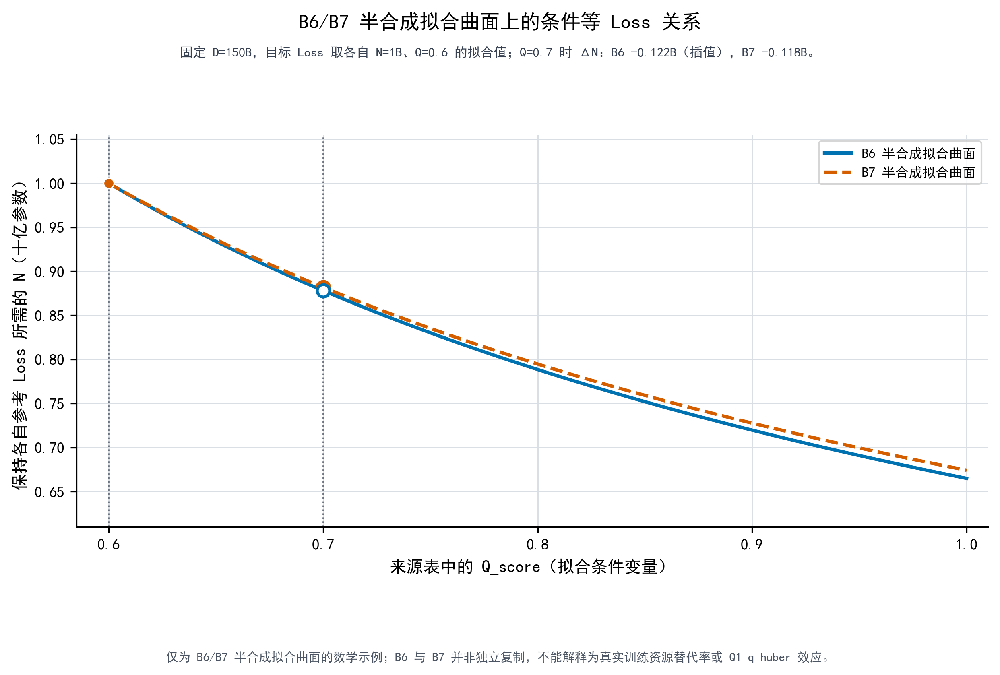
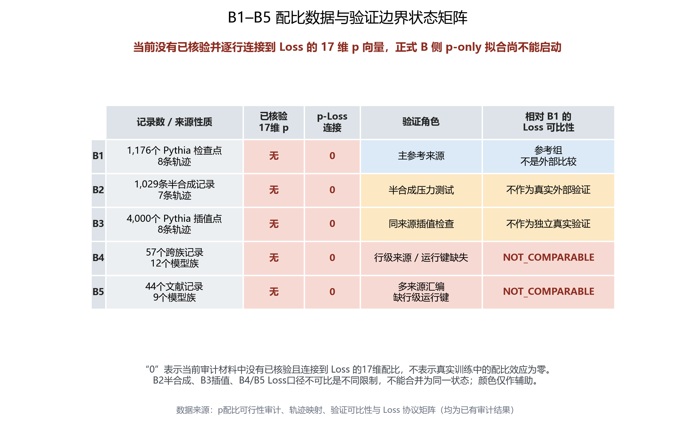

# 问题二：跨维度数据融合与广义标度律

> **作答稿说明：**本稿按题面要求给出模型、可计算参数、边际效应、弹性、配比关系、等 Loss 替代条件、验证和大尺度情景结果。由于现有附件没有可核验的 B 侧配比—Loss 联合观测，以下把真实数据、A 侧配方实验和半合成质量响应分开报告。广义式是明确可检验的整合假设；分块估计不等同于在共同样本上估计出的完整联合模型。

## 1. 广义标度律与估计对象

令 $n=N/10^9$ 表示十亿参数，$d=D/10^9$ 表示十亿训练 Token。B1 的经典基线采用

\[
L_0(n,d)=E+A n^{-\alpha}+B d^{-\beta}.
\tag{1}
\]

在此基础上，把数据质量和 17 域配比的作用表示为有效训练数据倍率：

\[
L(n,d,Q,\boldsymbol p)
=E+A n^{-\alpha}
+B\left[d\exp\{h(Q,\boldsymbol p)\}\right]^{-\beta},
\tag{2}
\]
\[
h(Q,\boldsymbol p)
=g_p(\boldsymbol p)-g_p(\boldsymbol p_0)
+\gamma_Q\log(Q/Q_0),\qquad
h(Q_0,\boldsymbol p_0)=0.
\tag{3}
\]

这里 B 侧完整配比向量定义为 18 部分：17 个目标域加显式 `other`，满足 \(p_j\ge 0,\sum_{j=1}^{18}p_j=1\)；\(g_p\) 描述组成带来的对数有效数据变化，\(\gamma_Q\) 描述质量变化对有效数据倍率的作用。The Pile 的 22 个来源中，17 项映射到目标域、权重合计 75.02%；其余 5 项合计 24.98%，保留在 `other`，不置零也不对 17 项重归一化。A4/A5 的 RegMix 配方是另一个 17 域闭合单纯形，以下作为独立的 A 侧证据报告，不与 B 侧 18 部分组成向量混为一谈。式（3）的可加结构是低参数、可检验的跨源整合假设，不表示数据已排除 \(p\times Q\) 交互。

当前可估计的信息来自三个不同来源：B1 提供真实的 \(N,D,L\) 基线；A4/A5 提供固定实验尺度上的配比—域级 Loss 关系；B6/B7 提供半合成网格上的条件质量响应。三者没有共同的训练运行键、检查点和已统一的质量量尺。因此，式（2）可作为待检验的广义模型形式，但其中 \(g_p\) 与 \(\gamma_Q\) 尚未在同一 B 侧样本上联合估计。A1 的冻结 `q_huber` 域宏平均为 0.4984781048；它不是 B1/Pythia 配方的实测混合质量。B6/B7 的 `Q_score` 与该 Q1 分数之间也没有经过验证的换算，故不把两者设成共同量尺。

## 2. B1 经典基线估计

B1 含 1,176 个检查点，映射为 8 条 Pythia 模型轨迹、每条 147 个检查点。只用 B1 拟合式（1），得到：

| 参数 | 估计值 | 参数 | 估计值 |
|---|---:|---|---:|
| \(E\) | 1.689797563 | \(A\) | 0.353980321 |
| \(\alpha\) | 0.339976582 | \(B\) | 1.240305584 |
| \(\beta\) | 0.279878129 |  |  |

B1 拟合内 RMSE 为 0.000146496，MAE 为 0.000105232，\(R^2=0.9999998\)，Spearman \(\rho=0.9999996\)。这些是拟合样本内指标，不作为独立验证。按 8 条轨迹进行的 1,000 次 cluster bootstrap 全部收敛；因独立轨迹只有 8 条，区间用于稳定性提示，不解释为高精度总体区间。

在 B1 中位参考点 \(n=1.228525,d=146.801\) 处，模型预测 Loss 为 2.3268348。由式（1）得：

| 局部量 | 估计值 | 轨迹 Bootstrap 95% 区间 |
|---|---:|---:|
| \(\partial L/\partial n\)，每十亿参数 | -0.09133882 | [-0.09135007, -0.09132459] |
| \(\partial L/\partial d\)，每十亿 Token | -0.0005852597 | [-0.0005853531, -0.0005851459] |
| \(\varepsilon_N\) | -0.0482252 | [-0.04823067, -0.04821795] |
| \(\varepsilon_D\) | -0.03692428 | [-0.03693047, -0.03691713] |

在该点附近，参数量增加 1% 对应模型预测 Loss 约下降 0.0482%；训练 Token 增加 1% 对应约下降 0.0369%。这是冻结 M0 的局部模型蕴含量，不表示 Q 或配比的效应。

## 3. 17 域配比效应及检验

A4/A5 共有 512 组训练配方、17 个组成域和 13 个域级 Loss 目标。对闭合单纯形配方进行分组嵌套交叉验证后，主模型选为 `simplex_ridge`，系数满足单纯形约束。完整训练集内选模流程的外层标准化 RMSE 为 0.63305。

冻结模型在 A6–A11 上的主要结果为：

| 评估尺度 | 配方数 | 宏平均 RMSE | 宏平均 \(R^2\) | 宏平均 Spearman | 解释 |
|---|---:|---:|---:|---:|---|
| 1M，同尺度留出 | 256 | 0.45386 | 0.61889 | 0.83266 | 支持有限的来源内预测 |
| 60M，跨尺度留出 | 256 | 1.55902 | -7.93357 | 0.83139 | 绝对 Loss 校准失败 |
| 1B，跨尺度留出 | 64 | 3.19699 | -810.11959 | 0.72685 | 绝对 Loss 校准失败 |

按组中心化后，60M 的相对配比响应优于组内均值基线（宏平均 \(R_c^2=0.53793\)，95% 区间 [0.50233, 0.56847]），但 1B 仍不支持（\(R_c^2=-4.44070\)，区间 [-7.43323, -2.75666]）。中心化只检验组内相对响应，不能解释为绝对跨尺度预测通过。

A12–A15 的 10B/70B 表是估算表一致性检查，不是真实测试集。与估算值的偏差为：10B 的宏平均 RMSE=3.60155、\(R^2=-236.85818\)；70B 的宏平均 RMSE=3.98477、\(R^2=-385.31394\)。它们显示当前配比模型在这些估算表上的一致性较差，不能称作 10B/70B 的测试精度或验证通过。

一个可解释的组成转移例子是：在 A4/A5 平均闭合配方附近，将 10 个百分点从 `train_the_pile_arxiv` 转至 `train_the_pile_freelaw`，A 侧 `simplex_ridge` 对 Arxiv 验证 Loss 的预测增加 0.39629，配方组 Bootstrap 95% 区间为 [0.33531, 0.45569]。相对于该基点预测 Loss 5.04406，有限 10 个百分点变化约为 +7.86%。在参考配方的 \(p_i,p_j>0\) 时，局部组成对数比方向弹性定义为
\[
\varepsilon_{i/j}=\frac{1}{L}\frac{\partial L}{\partial\log(p_i/p_j)}
=\frac{\partial L/\partial\delta}{L(1/p_i+1/p_j)},
\]
其中 \(\delta\) 表示从域 \(j\) 向域 \(i\) 的份额转移。该基点的弹性为 0.04097；把 10 个百分点转移效应的 Bootstrap 区间代入并固定参照配方，条件区间为 [0.03467, 0.04711]。只有 28.1% 的训练配方支持这一供体份额，故此结果仅适用于该 A 侧目标和转移方向，不能移植为 B 侧标度律系数。

## 4. 边际效应、弹性与领域替代/互补

令
\[
S=A n^{-\alpha},\qquad
T=B d^{-\beta}\exp[-\beta h(Q,\boldsymbol p)],\qquad L=E+S+T.
\]
若 \(h\) 不直接依赖 \(n,d\)，则
\[
\frac{\partial L}{\partial n}=-\frac{\alpha S}{n},\quad
\varepsilon_N=\frac{n}{L}\frac{\partial L}{\partial n}=-\frac{\alpha S}{L};\qquad
\frac{\partial L}{\partial d}=-\frac{\beta T}{d},\quad
\varepsilon_D=\frac{d}{L}\frac{\partial L}{\partial d}=-\frac{\beta T}{L}.
\tag{4}
\]

当 \(h_Q=\partial h/\partial Q\) 时，
\[
\frac{\partial L}{\partial Q}=-\beta T h_Q,
\qquad \varepsilon_Q=\frac{Q}{L}\frac{\partial L}{\partial Q}
=-\frac{\beta TQh_Q}{L}.
\tag{5}
\]
若采用式（3）的对数质量项，则 \(h_Q=\gamma_Q/Q\)，所以 \(\partial L/\partial Q=-\beta\gamma_QT/Q\)，\(\varepsilon_Q=-\beta\gamma_QT/L\)。当前这两个 Q 量只能在 B6/B7 半合成曲面内作条件计算。

B 侧完整组成向量位于 18 部分单纯形，A4/A5 配方位于 17 域单纯形；两者的分量都受总和为 1 的约束，不能当作彼此独立的普通变量。令 \(\delta\) 表示从域 \(j\) 向域 \(i\) 转移份额，则 \(\boldsymbol p(\delta)=\boldsymbol p+\delta(\boldsymbol e_i-\boldsymbol e_j)\)，局部效应为
\[
\frac{\mathrm dL}{\mathrm d\delta}
=-\beta T\left(\frac{\partial g_p}{\partial p_i}-\frac{\partial g_p}{\partial p_j}\right).
\tag{6}
\]
式（6）是广义有效数据倍率模型给出的条件解析方向效应。A4/A5 的 `simplex_ridge` 直接拟合 17 域配比到域级 Loss 的关系，其有限 10 个百分点转移量是独立的 A 侧来源内关联，并未估计 \(g_p\)，也没有与式（6）的系数映射。B 侧的 \(g_p\) 导数当前未估计。

互补/替代必须相对于指定基点和两条满足单纯形约束的转移方向定义。若方向为 \(\boldsymbol u,\boldsymbol v\)，则
\[
D_{\boldsymbol u}D_{\boldsymbol v}L
=T\{\beta^2(D_{\boldsymbol u}h)(D_{\boldsymbol v}h)
-\beta D_{\boldsymbol u}D_{\boldsymbol v}h\}.
\tag{7}
\]
二阶交叉项小于 0 表示后一转移增强前一转移的降 Loss 收益，可称为该基点、该方向上的互补；大于 0 表示边际收益递减，可称为替代；接近 0 则没有可辨的局部交叉效应。线性 `simplex_ridge` 主模型对配比没有曲率，因此它的零交叉项是模型设定，不是数据证明各域之间没有互补。

A 侧直接 Loss 空间的二次敏感性模型对 6,551 个候选可行转移对进行条件 max-|t| 家族校正后，39 对区间全为正、0 对全为负、6,512 对跨零。该候选筛选步骤未校正，结论仍限于 A 侧探索性结果；正向区间提示特定方向的收益递减，不支持普遍领域互补。没有 B 侧配比数据，不能据此对 B 侧作结论。

## 5. 质量提升与扩大模型的等 Loss 条件

固定 \(d,\boldsymbol p,L\)，由全微分 \(L_n\mathrm dn+L_Q\mathrm dQ=0\) 得
\[
\left.\frac{\mathrm dn}{\mathrm dQ}\right|_{L,d,\boldsymbol p}
=-\frac{L_Q}{L_n}
=-\frac{\beta T h_Q n}{\alpha S}.
\tag{8}
\]
当 \(h_Q>0\) 时，该斜率为负：在模型条件下，质量提高允许以较小参数量维持相同 Loss。该式给出等 Loss 条件，不是等算力关系；数值大小取决于可识别的质量响应系数。

B6/B7 半合成曲面上可给出具体的代数示例：固定 \(d=150\)（即 \(D=150\)B Token）、起点 \(n=1\)（即 \(N=1\)B 参数）、\(Q=0.6\)，把 Q 提至 0.7 后重新求等 Loss 的参数量：

| 数据 | 拟合 \(\gamma_Q\) | 起点拟合 Loss | 等 Loss 参数量 | 参数量变化 |
|---|---:|---:|---:|---:|
| B6 半合成 | 1.21645 | 2.48451 | 0.878085B | -0.121915B |
| B7 半合成 | 1.17977 | 2.48856 | 0.881795B | -0.118205B |

这只是半合成拟合曲面上的固定 \(D\) 等 Loss 示例，不是实测训练结果或实际缩放建议。B6 留一 Q 水平 RMSE 从 M0 的 0.14514 降至含 Q 模型的 0.08984；B7 对应从 0.12954 降至 0.08432。B7 与 B6 的 360/360 重合行完全复用，不是独立复制实验。更重要的是，B8 在固定 \(N,D\) 后的 Q–Loss 斜率方向与 B6/B7 相反：B8 校准层 90/90 组为正，外推层 60/60 组为正。故不将三份数据合并估计唯一真实 Q 系数，也不把 B6/B7 的 \(\gamma_Q\) 当作 Q1 `q_huber` 的效应。

## 6. 验证、跨源边界与 10B 以上情景

冻结的 B1 M0 对 B2–B5 的分源误差如下。数值诊断均保留，但来源角色决定能否称为验证：

| 数据 | 行数 | RMSE | MAE | \(R^2\) | 本文解释 |
|---|---:|---:|---:|---:|---|
| B2 | 1,029 | 1.24308 | 1.17844 | -5.0728 | 半合成压力测试，不是独立真实验证 |
| B3 | 4,000 | 0.003821 | 0.002893 | 0.999958 | Pythia 同源插值；不是独立轨迹/来源验证 |
| B4 | 57 | 0.292667 | 0.227263 | 0.604505 | Loss 协议及逐点来源未核实，对 B1 标为不可比 |
| B5 | 44 | 0.197595 | 0.170722 | 0.730559 | 多来源文献口径未统一，对 B1 标为不可比 |

因此，B3 仅支持同源轨迹插值形状检查；B2 用于半合成压力测试；B4/B5 不能因误差已计算而宣称跨族或文献验证通过。B1–B5 之间的单位、评测切分、Tokenizer/预处理及逐模型版本证据不足，所有来源不合并评分。

B9/B10 用于讨论百亿参数以上的情景。B10 有 128 行估算 Loss，均与 B9 模型名匹配；其参数量范围为 100B–10,000B，128/128 行超过 B1 的参数量上界 11.9658B，另有 102/128 行超过 B1 的数据量上界 299.893B。将 B10 代入冻结 M0 得到 Loss 预测范围 1.78384–4.08630，中位数 1.90642。该结果是远离 B1 支持域的估算情景，不是外部验证；参数 Bootstrap 未涵盖远距离外推的模型形式误差或跨来源 Loss 协议偏差。

## 7. 问题二结论

现有结果给出了可检验的四变量广义标度律形式，并分别得到三类具体证据：B1 上的 \(N,D\) 基线及边际效应；A4/A5 上受限的域配比—Loss 关系；B6/B7 半合成数据上的条件质量响应。A6–A11 显示配比模型在 1M 同尺度下有预测支持、跨至 60M/1B 时绝对 Loss 预测失败；A12–A15 与估算值的一致性也较差。B8 的质量方向与 B6/B7 相反，故质量系数不能合并为单一实证值。

截至本稿，B1–B5 经核验并与 Loss 逐行连接的检查点累计组成 \(\boldsymbol p(D)\) 为 **0 行**。B1 的 1,176 行静态 Pile 权重候选只有同一个 18 部分向量（包括 `other`），不代表每个检查点实际累计见到的来源组成，也不能识别已映射域之间的替代效应。Q1 的 `q_huber` 接口已冻结，但 B 侧没有与同一训练运行相连、且独立于配比变化的质量观测。因此，B 侧 \(g_p\)、真实独立 \(Q\) 边际效应和完整 M1/M2 联合经验标度律均为**未估计**，不能将未识别解释为效应为零。

若取得逐检查点来源 Token 计数及版本化 Q，且能与同一运行的 \(N,D,L\) 严格配对，再证明多个配方与 Q 在控制 \(N,D\) 和模型族后仍有独立变化，便可按 M0→M1→M2 的嵌套顺序拟合和验证式（2）。在此之前，当前可报告的结论是分来源的条件估计、上述解析关系及其验证边界，不是完整联合模型的经验验证。

### 正文配图候选

- [B1 的 N/D 边际效应与弹性](../../../04_图表/q2_full_answer/result_q2_m0_elasticity_profile.png)
- [A 侧配比模型同尺度与跨尺度结果](../../../04_图表/q2_full_answer/result_q2_p_cross_scale_rmse.png)
- [B6/B7/B8 固定 N、D 的 Q 方向对照](../../../04_图表/q2_full_answer/result_q2_q_matched_slope_conflict.png)
- [B6/B7 半合成等 Loss 曲线](../../../04_图表/q2_evidence_complements/result_q2_b6_b7_conditional_equal_loss.png)

### 本稿内部复核入口（并入竞赛正文前删除）

- B1 基线与 B2–B5 分源验证：`Q2/03_结果/经典ScalingLaw基线/v1/q2_scaling_baseline_report.md`
- B1 边际效应与弹性：`Q2/03_结果/经典ScalingLaw基线/v1/q2_m0_marginal_effects_report.md`
- A4/A5 及 A6–A15 配比结果：`Q1/03_结果/Q1.3/v1/q1_3_run_report.md`
- A 侧跨尺度中心化诊断：`Q2/03_结果/G1相对效应迁移检验/v1/G1_centered_transfer_report.md`
- B6–B10 补充、互补分析及识别边界：`Q2/03_结果/完整回答补充/v1/q2_full_answer_evidence_supplement.md`
- B 侧 p–Loss 门禁：`Q2/03_结果/p配比可行性审计/v2/q2_p_gap_resolution_report.md`
- Q 独立增量效应门禁：`Q2/03_结果/综合收口/v1/q2_q_incremental_effect_gate.md`

### 参考文献

1. Hoffmann, J., Borgeaud, S., Mensch, A., et al. *Training Compute-Optimal Large Language Models*. NeurIPS 35, 2022.
2. Xia, M., et al. *RegMix: Data Mixture as Regression for Language Model Pre-training*. ICML, 2024.
3. Biderman, S., et al. *Pythia: A Suite for Analyzing Large Language Models Across Training and Scaling*. ICML, 2023.
