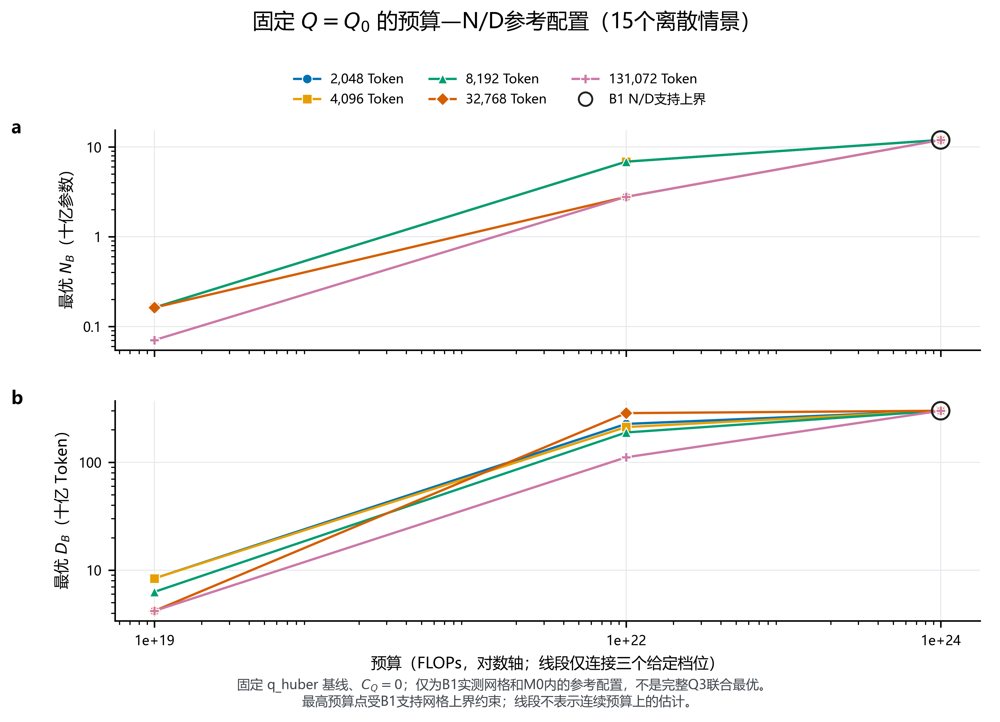
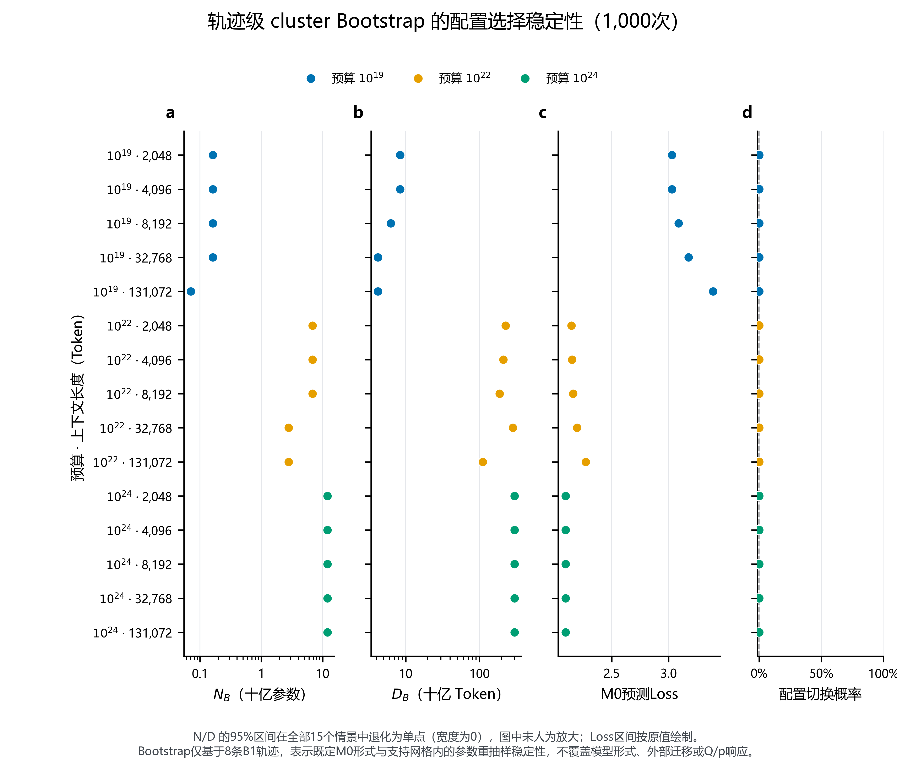
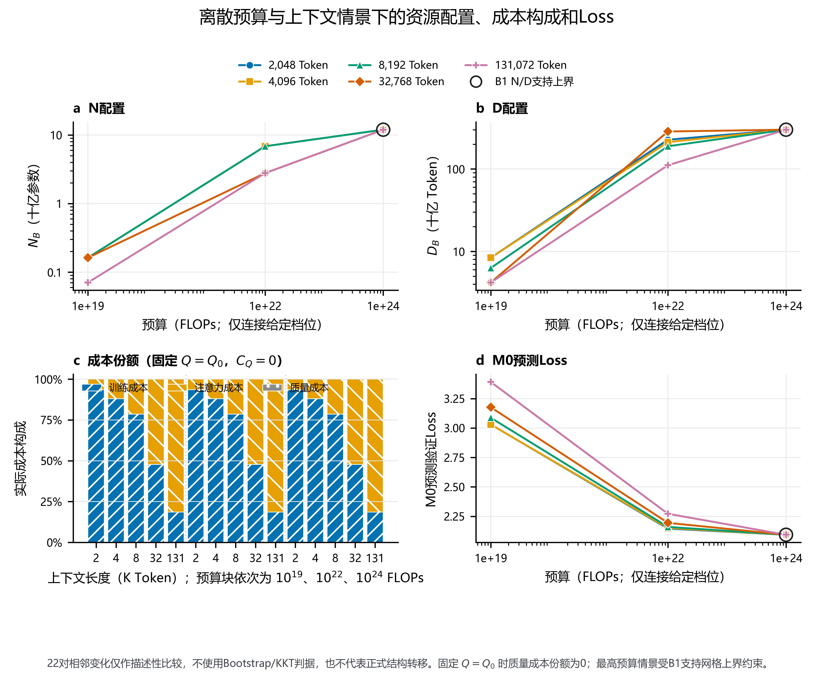
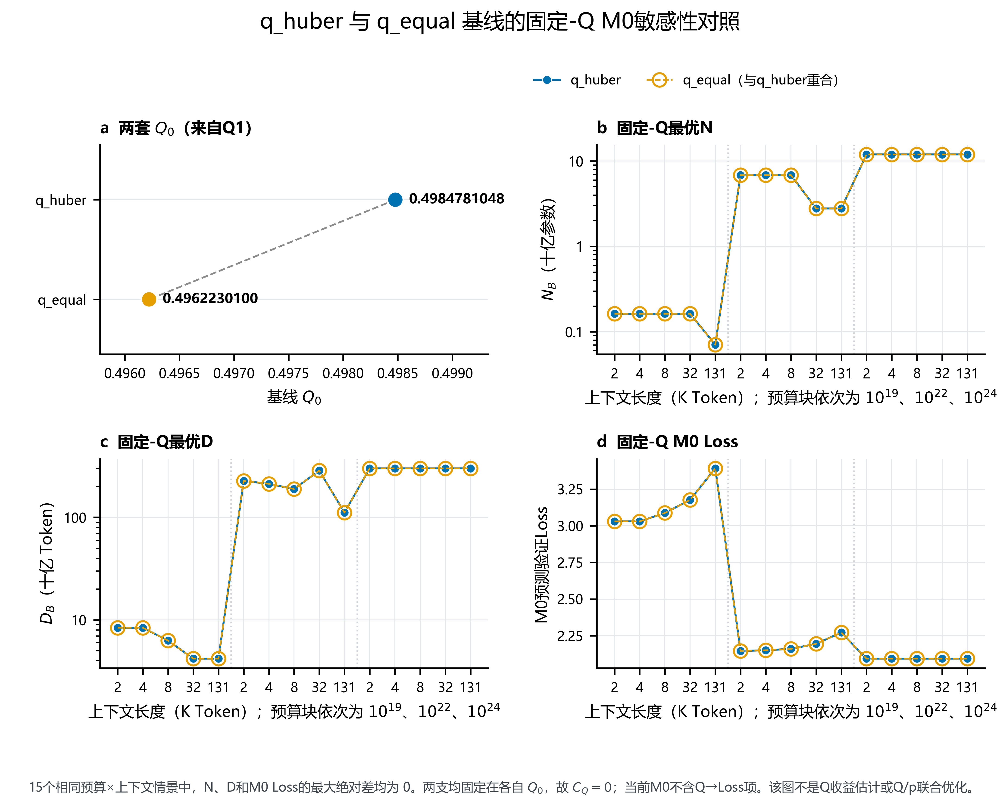
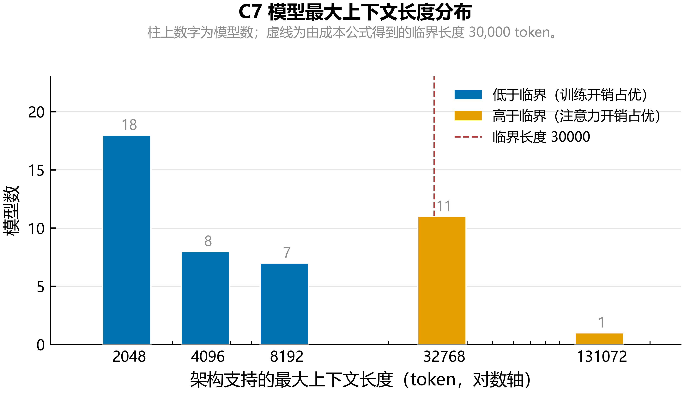
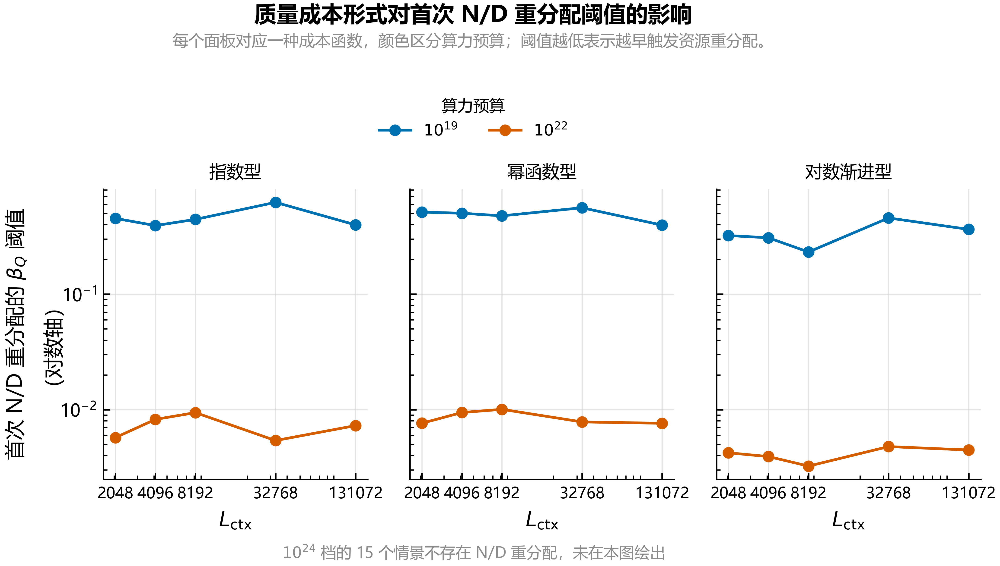

# Q3 追加候选图集

本图集保留 6 张 Q3 候选图及其 PNG、PDF、SVG、灰度 PNG 导出，共 24 个文件。所有文件均已保存在 Q3 目录内，SHA-256 见本目录的 `figure_manifest.json`。

这些图先作为候选图保存，方便集中审阅和后续取舍；它们不自动代表已纳入论文正文的最终图。当前可查看和校验的副本均位于 Q3；使用这些图件不需要外部目录。完整文件清单和哈希见 [figure_manifest.json](figure_manifest.json)。

本候选套件按静态图件归档：原图件导出目录没有附带生成脚本或复现清单。正式补充图 P1–P3 的重绘入口见 `Q3/03_代码/图表源/`；该入口可重绘正式版，不声称逐字节再生本候选套件的替代版式。

## Q3 补充图表

### P1 预算—N/D 前沿

展示 15 个预算×上下文离散情景的参考配置。与主报告图 1 的固定 Q 配置结果有信息重叠；预算档位之间的连线只连接观测情景，不代表连续预算估计。

文件：[PNG](Q3补充图表/result_q3_p1_budget_nd_frontier.png) · [PDF](Q3补充图表/result_q3_p1_budget_nd_frontier.pdf) · [SVG](Q3补充图表/result_q3_p1_budget_nd_frontier.svg) · [灰度 PNG](Q3补充图表/result_q3_p1_budget_nd_frontier_grayscale.png)

### P2 Bootstrap 配置稳定性

呈现固定 Q 情景下 N、D 和预测 Loss 的 Bootstrap 区间与选择频率。与主报告图 3 的稳定性内容相关；解释范围仍限于 8 条 B1 轨迹、既定 M0 形式和观测支持域。

文件：[PNG](Q3补充图表/result_q3_p2_bootstrap_selection_stability.png) · [PDF](Q3补充图表/result_q3_p2_bootstrap_selection_stability.pdf) · [SVG](Q3补充图表/result_q3_p2_bootstrap_selection_stability.svg) · [灰度 PNG](Q3补充图表/result_q3_p2_bootstrap_selection_stability_grayscale.png)

### P3 资源配置仪表盘

汇总配置、成本份额和 Loss；相邻情景变化是描述性比较，不代表因果或正式结构转移结论。它与主报告图 1、图 5 的部分面板重叠。

文件：[PNG](Q3补充图表/result_q3_p3_resource_shift_dashboard.png) · [PDF](Q3补充图表/result_q3_p3_resource_shift_dashboard.pdf) · [SVG](Q3补充图表/result_q3_p3_resource_shift_dashboard.svg) · [灰度 PNG](Q3补充图表/result_q3_p3_resource_shift_dashboard_grayscale.png)

### P4 Q 基线敏感性

对比 $q_{huber}$ 与 $q_{equal}$ 基线。固定 Q 的 M0 下 N、D 和 Loss 重合，变化集中在 $Q_0$；这可作基线选择的说明图，不表示经验 Q 收益，也不代表完整 Q/p 联合优化。此前它未收入正式补充图集，本轮按“先集中补入、后续可筛删”的要求暂存于候选区。

文件：[PNG](Q3补充图表/result_q3_p4_q_baseline_sensitivity.png) · [PDF](Q3补充图表/result_q3_p4_q_baseline_sensitivity.pdf) · [SVG](Q3补充图表/result_q3_p4_q_baseline_sensitivity.svg) · [灰度 PNG](Q3补充图表/result_q3_p4_q_baseline_sensitivity_grayscale.png)

## 核心图表

### C7 上下文长度分布

展示 45 个模型的 `max_position_embeddings` 档位和 30,000 临界长度。审计报告已嵌入同一张图：[C7 上下文长度审计报告](../../../02_数据审计/C7上下文长度审计报告.md)。架构支持的最大位置数不保证等于本题实际部署或推理窗口。

文件：[PNG](核心图表/q3-c7-lengths.png) · [PDF](核心图表/q3-c7-lengths.pdf) · [SVG](核心图表/q3-c7-lengths.svg) · [灰度 PNG](核心图表/q3-c7-lengths_grayscale.png)

### 条件 Q 敏感性

展示条件质量增益与资源配置对阈值/情景设定的响应。它与主报告图 6 的 T4 阈值分析有重叠，可作为另一种解释视图；$β_Q$ 仍未识别，不能据此宣称完整联合优化已求得。

文件：[PNG](核心图表/q3-conditional.png) · [PDF](核心图表/q3-conditional.pdf) · [SVG](核心图表/q3-conditional.svg) · [灰度 PNG](核心图表/q3-conditional_grayscale.png)
