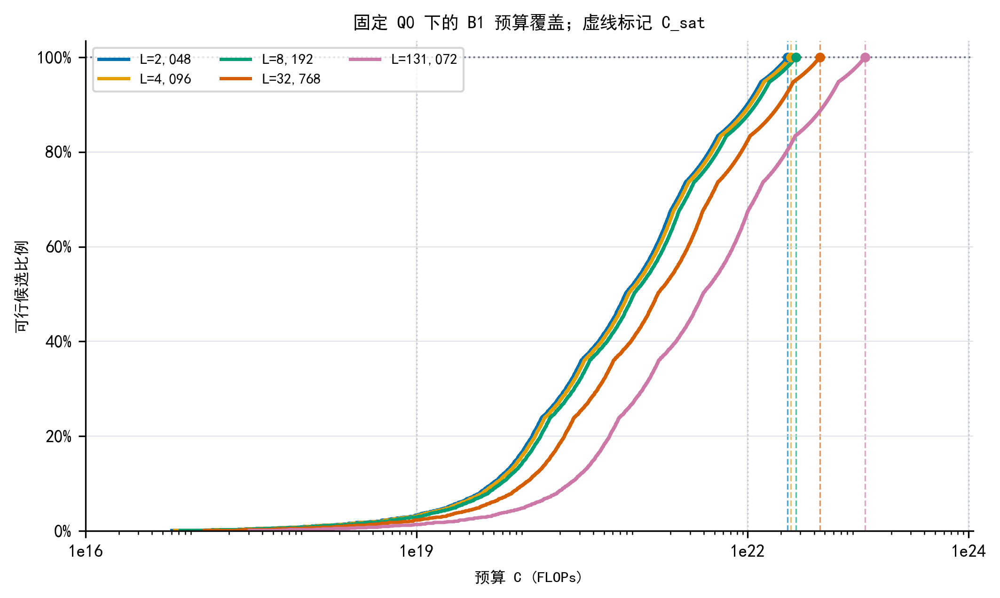

# Q3 预算饱和与有限网格切换分析

**范围：** 固定 Q=Q₀、冻结 M0 预测 Loss、B1 的 1,176 个精确观测 N/D 候选点。成本按 C=6ND+(NDL)/5000 重算，并与独立 M3/M4 成本网格逐点核对。

## 判定口径

- 当前离散支持域的饱和预算定义为 C_sat(L)=max_j C_j(L)。预算不低于该值时，这 1,176 个候选点全部预算可行；它不是支持域外配置的成本上界，也不表示全局物理饱和。
- 状态只用 budget_screening（当前网格仍有候选不可行）和 support_saturated（当前网格 1,176/1,176 可行）。同时给出预算/C_sat、可行点数、可行占比及剩余点数，不设置人为“接近饱和”阈值。
- 离散配置转折是有限支持网格下的精确枚举：候选在其实际成本处进入可行集合，若按既有 M1 顺序规则（最低 M0 Loss，其次成本、N、D、run_id）成为新最优点，则记录该成本为切换阈值。没有连续 KKT 临界值或网格间插值。
- 下表的正式预算情景均与既有 M0 前沿逐点核对；所有结论不扩展到 Q/p 联合经验最优。

## 支持域饱和预算

| 上下文 L | C_sat (FLOPs) | 1e19 可行 | 1e22 可行 | 1e24 可行 |
|---:|---:|---:|---:|---:|
| 2,048 | 2.30006e+22 | 39/1,176 (3.3%) | 1,060/1,176 (90.1%) | 1,176/1,176 (100.0%) |
| 4,096 | 2.44705e+22 | 36/1,176 (3.1%) | 1,049/1,176 (89.2%) | 1,176/1,176 (100.0%) |
| 8,192 | 2.74101e+22 | 34/1,176 (2.9%) | 1,032/1,176 (87.8%) | 1,176/1,176 (100.0%) |
| 32,768 | 4.50482e+22 | 27/1,176 (2.3%) | 969/1,176 (82.4%) | 1,176/1,176 (100.0%) |
| 131,072 | 1.156e+23 | 16/1,176 (1.4%) | 793/1,176 (67.4%) | 1,176/1,176 (100.0%) |

1e24 FLOPs 在 5 个上下文、15 个预算×上下文情景中均覆盖 1,176/1,176 个候选点。各情景距支持域饱和点的比值、候选可行份额和剩余候选数见 q3_formal_budget_coverage.csv。

## 正式预算间配置切换

| 上下文 L | 预算区间 | 配置是否改变 | 区间内离散切换数 | Loss 下降 | 切换后支持边界 |
|---:|---|---|---:|---:|---|
| 2,048 | low_to_mid | 是 | 274 | 0.884786 | 无 |
| 2,048 | mid_to_high | 是 | 85 | 0.0522317 | N_max;D_max |
| 4,096 | low_to_mid | 是 | 267 | 0.879639 | 无 |
| 4,096 | mid_to_high | 是 | 92 | 0.0573791 | N_max;D_max |
| 8,192 | low_to_mid | 是 | 257 | 0.927921 | 无 |
| 8,192 | mid_to_high | 是 | 103 | 0.0664657 | N_max;D_max |
| 32,768 | low_to_mid | 是 | 224 | 0.982186 | 无 |
| 32,768 | mid_to_high | 是 | 138 | 0.101281 | N_max;D_max |
| 131,072 | low_to_mid | 是 | 145 | 1.1205 | 无 |
| 131,072 | mid_to_high | 是 | 221 | 0.178211 | N_max;D_max |

完整预算轴上识别到 1865 个有限网格的最优点事件（含每个上下文的首个可行最优点）。所有事件阈值和切换前后配置见 q3_finite_grid_switch_events.csv；10 个正式预算区间的端点对照见 q3_formal_budget_switches.csv。

## 输出与复现

- q3_budget_saturation_by_context.csv：每个上下文的 C_sat 与三档预算覆盖摘要。
- q3_formal_budget_coverage.csv：15 个正式预算情景的可行候选数、比例、剩余数及饱和状态。
- q3_finite_grid_switch_events.csv：完整预算轴上的离散下包络切换阈值。
- q3_formal_budget_switches.csv：低→中、中→高两段正式预算端点比较。
- reproduction_manifest.json：脚本、输入、输出哈希及范围声明。

复现命令：python Q3/03_代码/analyze_q3_budget_grid_transitions.py
