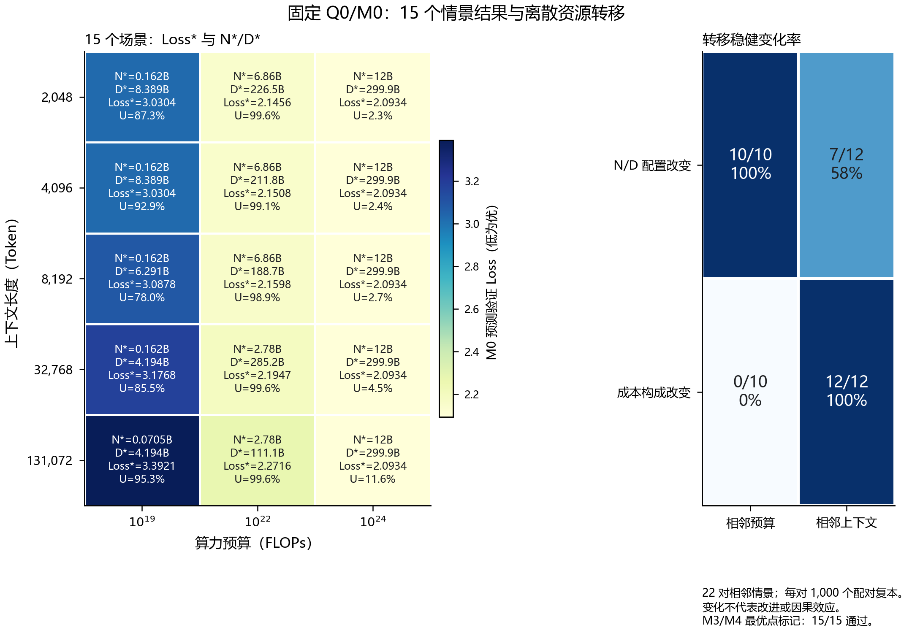
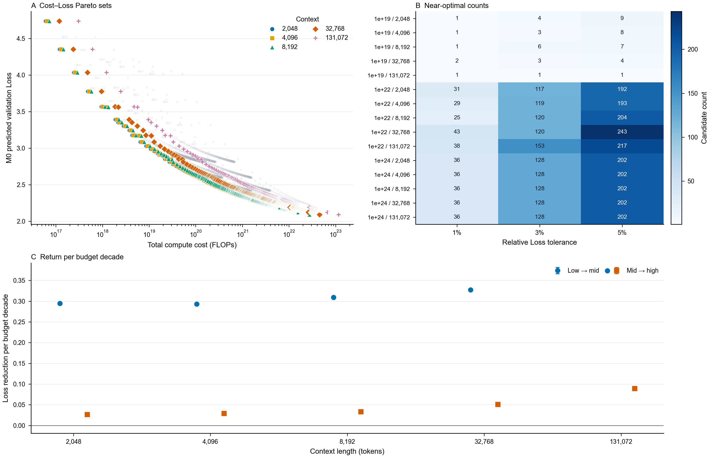
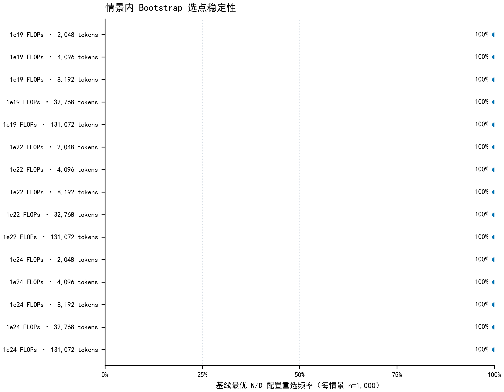
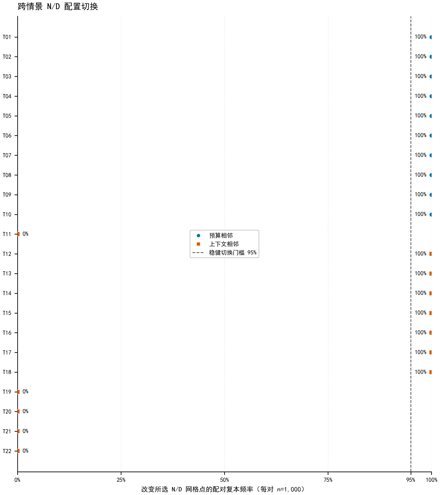
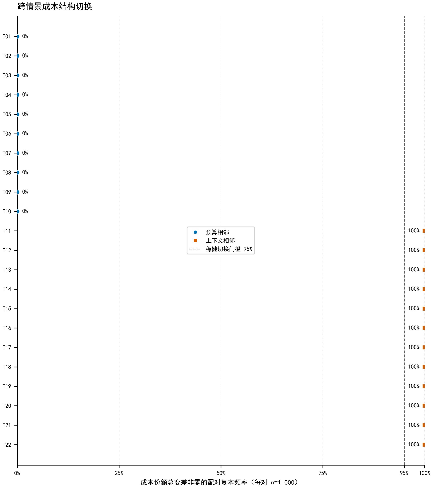
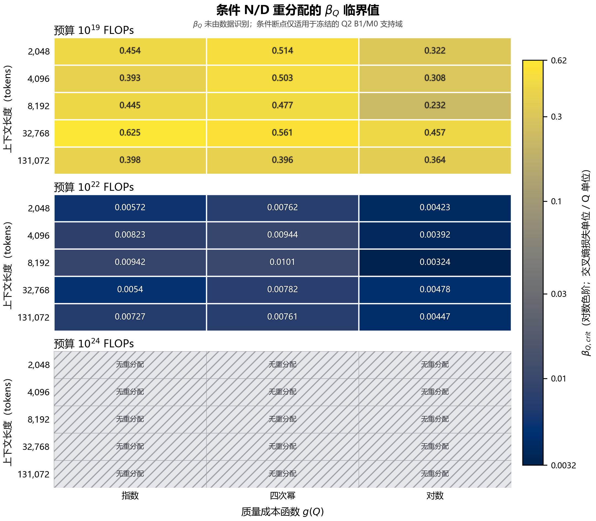

# Q3 本轮可识别结果范围报告

> **状态：** 本轮 Q3 可识别结果范围报告。覆盖固定 $Q=Q_0$ 的 M0/B1 经验参考支路、T2/T3 稳健性分析与 T4 条件敏感性；完整 Q/p 联合经验优化因 Q2 当前识别边界不纳入本轮正式结论，作为后续扩展方向记录。本稿不代表完整 Q/p 联合最优或竞赛论文提交版。

## 1. 固定 Q 的经验优化（T1/M3/M4）

在冻结的 Q₀ 和 M0 预测函数下，项目把 Q2 B1 的 1,176 个实测 $(N,D)$ 点作为离散候选支持网格，对 3 档预算与 5 档上下文形成的 15 个情景进行参考资源配置。T1 整合结果复用既有 M0/M1/M3/M4 与 Bootstrap 输出，没有在整合阶段重新拟合 M0 或扩大 Bootstrap。

M3/M4 独立审计复核了 5,880 行成本网格和 17,640 行预算掩码：成本恒等式失败为 0，条件单调性 11/11 通过，预算可行集嵌套 10/10 通过，M0/M1 选点的支持、预算和最终可行标记在 15/15 个情景中一致。固定 Q₀ 时质量增量成本为 0。最高预算下全部 1,176 个支持点可行，故最高预算 M0 选点利用率较低（2.30%–11.56%）应结合有限支持网格解释，不能直接视为域外预算无效或连续资源最优。

**来源：** [`01_fixed/Q3_fixedQ_results_integration_report.md`](01_fixed/Q3_fixedQ_results_integration_report.md)、[`01_fixed/q3_fixedQ_master_results.csv`](01_fixed/q3_fixedQ_master_results.csv)、[`01_fixed/q3_resource_transition.csv`](01_fixed/q3_resource_transition.csv)、[`01_fixed/M3_M4成本独立审计/m4_cost_audit_report.md`](01_fixed/M3_M4成本独立审计/m4_cost_audit_report.md) 及对应 reproduction manifests。

### 15 个预算—上下文参考配置

下表直接整理自 T1 权威主表；$N^*$、$D^*$ 单位为十亿，Loss 为 M0 预测验证损失，成本为 FLOPs。M4/M1 可行点数分别表示预算可行集与最终可行集规模。

| 预算 (FLOPs) | 上下文 tokens | $N^*$ (B) | $D^*$ (B) | M0 Loss | 总成本 (FLOPs) | 预算利用率 | M4 可行点 | M1 最终可行点 |
|---:|---:|---:|---:|---:|---:|---:|---:|---:|
| 1e19 | 2,048 | 0.162405 | 8.389 | 3.030398 | 8.7325e18 | 87.33% | 39 | 39 |
| 1e22 | 2,048 | 6.86104 | 226.492 | 2.145611 | 9.9603e21 | 99.60% | 1,060 | 1,060 |
| 1e24 | 2,048 | 11.965825 | 299.893 | 2.093379 | 2.3001e22 | 2.30% | 1,176 | 1,176 |
| 1e19 | 4,096 | 0.162405 | 8.389 | 3.030398 | 9.2906e18 | 92.91% | 36 | 36 |
| 1e22 | 4,096 | 6.86104 | 211.812 | 2.150759 | 9.9100e21 | 99.10% | 1,049 | 1,049 |
| 1e24 | 4,096 | 11.965825 | 299.893 | 2.093379 | 2.4470e22 | 2.45% | 1,176 | 1,176 |
| 1e19 | 8,192 | 0.162405 | 6.291 | 3.087766 | 7.8041e18 | 78.04% | 34 | 34 |
| 1e22 | 8,192 | 6.86104 | 188.744 | 2.159845 | 9.8916e21 | 98.92% | 1,032 | 1,032 |
| 1e24 | 8,192 | 11.965825 | 299.893 | 2.093379 | 2.7410e22 | 2.74% | 1,176 | 1,176 |
| 1e19 | 32,768 | 0.162405 | 4.194 | 3.176846 | 8.5506e18 | 85.51% | 27 | 27 |
| 1e22 | 32,768 | 2.782831 | 285.213 | 2.194660 | 9.9638e21 | 99.64% | 969 | 969 |
| 1e24 | 32,768 | 11.965825 | 299.893 | 2.093379 | 4.5048e22 | 4.50% | 1,176 | 1,176 |
| 1e19 | 131,072 | 0.070542 | 4.194 | 3.392088 | 9.5307e18 | 95.31% | 16 | 16 |
| 1e22 | 131,072 | 2.782831 | 111.149 | 2.271591 | 9.9642e21 | 99.64% | 793 | 793 |
| 1e24 | 131,072 | 11.965825 | 299.893 | 2.093379 | 1.1560e23 | 11.56% | 1,176 | 1,176 |

图 1 同时展示 15 个固定 Q 场景的最优资源点与成本利用情况，以及相邻场景的稳健变化比例；右侧变化比例区分 N/D 配置变化和成本结构变化。

## 2. 稳健性与决策灵活性（T2/T3）

### T2 近优、Pareto 与边际收益

T2 在固定 $Q=Q_0$、不优化 $p$ 的条件下，对 M3 允许的 1,176 个 B1 实测 $(N,D)$ 点作有限域穷举。每个预算×上下文情景以其最低 M0 预测 Loss 为基准，按相对差不超过 1%、3%、5% 定义近优集；Cost–Loss Pareto 在每个上下文内精确识别成本和样本内 M0 Loss 的非支配点。低→中、中→高的边际收益用每提升一个预算数量级对应的 Loss 下降衡量，并附同编号、1,000 次轨迹 Bootstrap 配对区间。

**近优候选数：**

| 预算 FLOPs | 上下文 | 可行候选 | 1% 近优 | 3% 近优 | 5% 近优 |
|---:|---:|---:|---:|---:|---:|
| 1e19 | 2,048 | 39 | 1 | 4 | 9 |
| 1e19 | 4,096 | 36 | 1 | 3 | 8 |
| 1e19 | 8,192 | 34 | 1 | 6 | 7 |
| 1e19 | 32,768 | 27 | 2 | 3 | 4 |
| 1e19 | 131,072 | 16 | 1 | 1 | 1 |
| 1e22 | 2,048 | 1,060 | 31 | 117 | 192 |
| 1e22 | 4,096 | 1,049 | 29 | 119 | 193 |
| 1e22 | 8,192 | 1,032 | 25 | 120 | 204 |
| 1e22 | 32,768 | 969 | 43 | 120 | 243 |
| 1e22 | 131,072 | 793 | 38 | 153 | 217 |
| 1e24 | 2,048 | 1,176 | 36 | 128 | 202 |
| 1e24 | 4,096 | 1,176 | 36 | 128 | 202 |
| 1e24 | 8,192 | 1,176 | 36 | 128 | 202 |
| 1e24 | 32,768 | 1,176 | 36 | 128 | 202 |
| 1e24 | 131,072 | 1,176 | 36 | 128 | 202 |

**Pareto 前沿：**五种上下文各有 373 个非支配点，共 1,865 点。Pareto 表另列出每个预算下各前沿点是否可行；前沿范围是固定 Q₀、M0 和 B1 观测支持域。

**边际收益：**

| 上下文 | 区间 | Loss 下降 | 相对下降 | 每预算数量级下降 | 配对 Bootstrap 95% 区间 |
|---:|---|---:|---:|---:|---:|
| 2,048 | 低→中 | 0.884786 | 29.197% | 0.294929 | [0.884701, 0.884857] |
| 2,048 | 中→高 | 0.052232 | 2.434% | 0.026116 | [0.052222, 0.052241] |
| 4,096 | 低→中 | 0.879639 | 29.027% | 0.293213 | [0.879555, 0.879709] |
| 4,096 | 中→高 | 0.057379 | 2.668% | 0.028690 | [0.057369, 0.057388] |
| 8,192 | 低→中 | 0.927921 | 30.052% | 0.309307 | [0.927835, 0.927993] |
| 8,192 | 中→高 | 0.066466 | 3.077% | 0.033233 | [0.066455, 0.066476] |
| 32,768 | 低→中 | 0.982186 | 30.917% | 0.327395 | [0.982096, 0.982273] |
| 32,768 | 中→高 | 0.101281 | 4.615% | 0.050640 | [0.101259, 0.101308] |
| 131,072 | 低→中 | 1.120498 | 33.033% | 0.373499 | [1.120410, 1.120630] |
| 131,072 | 中→高 | 0.178211 | 7.845% | 0.089106 | [0.178185, 0.178236] |

所有上下文的中→高每预算数量级改善低于低→中。高预算下 1,176 个 B1 点全部可行，且最优配置到达网格的 $N,D$ 上界，因此这些结果不外推到更大的模型或训练数据量。

**来源：** [`T2 报告`](02_robustness/T2/report.md)、[`近优表`](02_robustness/T2/q3_near_optimal.csv)、[`Pareto 表`](02_robustness/T2/q3_pareto.csv)、[`边际收益表`](02_robustness/T2/q3_marginal_return.csv)及其 reproduction manifest。15 个情景的 M0/M1 选点、M4 成本/预算标记与既有 Bootstrap 摘要均已复核。

### T3 Bootstrap 稳定性与相邻情景切换

现有 15 个预算—上下文情景各使用 1,000 次完整轨迹 Bootstrap，基线最优 N/D 点在每个情景中均被重选，且每情景只出现一个被选网格点。对 22 对相邻情景进行 1,000 次同编号配对比较后，17/22 对达到 N/D 配置改变频率 ≥95%，12/22 对达到成本结构改变频率 ≥95%。预算相邻比较为 N/D 10/10、成本结构 0/10；上下文相邻比较为 N/D 7/12、成本结构 12/12。

N/D 离散配置改变与成本份额结构改变是两项不同判据，已分开报告、分表和分图。Bootstrap 结果描述固定 M0 与 B1 支持域内的参数敏感性；相邻变化是离散条件下的转移审计，不说明变化方向更优，也不构成因果效应或独立外部验证。

**来源：** [`02_robustness/T3/report.md`](02_robustness/T3/report.md)、三张标准 CSV、[`reproduction_manifest.json`](02_robustness/T3/reproduction_manifest.json) 和 [`p1_smoke_receipt.json`](02_robustness/T3/p1_smoke_receipt.json)。标准包中的 P1 回执为 PASS；独立 T3 范围 P2 的核查范围与结论见 [T3 优化执行记录](QA/Q3-T3_Bootstrap稳定性与配置切换_P2范围记录.md)。该 P2 不覆盖 Q3 其他任务或整体冻结门禁。

### M0 函数形式敏感性与整轨迹留一决策

T3 的参数 Bootstrap 不覆盖函数形式误差。为补充这一点，在相同的 1,176 个 B1 观测点和 15 个预算—上下文情景上，比较当前 M0、固定损失下限 $E=0$ 的形式，以及共享指数 $\alpha=\beta$ 的形式。按 8 条 Pythia 轨迹整条留一，每条留出 147 个检查点；当前 M0 的逐轨迹参数沿用 Q2 权威 `leave_one_size_out.csv`，两个受限形式分别对全样本和 8 个训练折拟合。每次受限形式拟合的 16 个优化初值均收敛。比较只覆盖这两项预先限定的结构约束，不穷尽模型形式不确定性。

| 模型形式 | 整轨迹留一 RMSE（pooled OOF） | 拟合说明 | 全样本选点相对 M0 改变 | 留一选点与 M0 全样本一致 |
|---|---:|---|---:|---:|
| 当前 M0：$E$、$\alpha$、$\beta$ 自由 | 0.00015118 | 沿用 Q2 权威逐轨迹拟合 | 0/15 | 120/120 |
| 去掉 Loss 下限：$E=0$ | 0.0728758 | 9 次拟合均为 16/16 初值收敛 | 9/15 | 50/120（41.7%）|
| 共享指数：$\alpha=\beta$ | 0.0142510 | 9 次拟合均为 16/16 初值收敛 | 1/15 | 112/120（93.3%）|

RMSE 是 8 折整轨迹留出的 pooled 预测误差，不是独立外部验证。当前 M0 的留一选点在 120/120 次比较中与其全样本选点一致。去掉 Loss 下限后改变的 9 个全样本配置包括：$10^{19}$ FLOPs 下上下文 2,048、4,096、8,192、32,768 tokens 的 4 个情景，以及 $10^{22}$ FLOPs 下全部 5 个情景；共享指数形式只在 $10^{22}$ FLOPs、32,768 tokens 情景改变选点。无下限形式的留出误差明显更大，因此这 9 个变化应作为模型形式敏感性压力对照解读，不表示该形式与当前 M0 有相同的经验支持。

最高预算下的选点为 $N=11.965825$B、$D=299.893$B，恰在当前 1,176 点支持网格的最大边界。留一拟合仍在固定完整候选网格上做 Q3 选点；当选点来自被留出的最大规模轨迹时，该候选在该折训练尺度之外，结果已单独标记。因此结论只表示现有候选范围内的最优配置，不外推到更大模型或更多训练数据。该比较固定 $Q=Q_0$ 且不含 $p$，也不是完整 Q3 联合最优。

本敏感性分析的 P1 与独立范围 P2 均通过；复核只覆盖本分析及报告引用的一致性，不等同于完整经验 Q/p 联合优化或竞赛提交级 QA。逐折参数、留出指标、3,528 条预测、360 个折内选点、复现命令和哈希见[专题报告](02_robustness/model_form_sensitivity/report.md)、[函数形式汇总表](02_robustness/model_form_sensitivity/q3_function_form_summary.csv)、[折内选点明细](02_robustness/model_form_sensitivity/q3_loto_scenario_selections.csv)及[复现清单](02_robustness/model_form_sensitivity/reproduction_manifest.json)。

## 3. 条件质量优化（T4）

T4 在条件式 $L_{cond}=L_{M0}(N,D)-\beta_Q(Q-Q_0)$、$\beta_Q\ge0$ 下，比较题面三种质量成本函数和既有预算/上下文情景。输出覆盖 45 个条件情景：166 个 regime 中，30 个存在有限的首次 N/D 重分配阈值，15 个没有有限阈值。基线 $Q_0=0.4984781048$ 来自冻结的 Q1 `q_huber` 接口。

按成本函数分组，每组覆盖 15 个预算—上下文情景；下表给出有限首次重分配阈值的实际范围，以及各组在 $\beta_Q$ 轴上的条件配置区间数。

| 质量成本函数 $g(Q)$ | 情景数 | 有限阈值 | 无有限阈值 | 条件配置区间数 | 有限 $\beta_Q$ 首次阈值范围 |
|---|---:|---:|---:|---:|---:|
| Exponential | 15 | 10 | 5 | 66 | 0.005397–0.624520 |
| Power 4 | 15 | 10 | 5 | 71 | 0.007613–0.560687 |
| Logarithmic | 15 | 10 | 5 | 29 | 0.003241–0.457433 |

阈值单位为每增加一个 Q 分数单位对应的验证 Loss 单位；区间数是条件最优配置在不同 $\beta_Q$ 范围内发生变化的片段数，不是置信区间。

$\beta_Q$ 未由 Q2 数据识别；这些数值是条件 break-even 阈值，而非估计出的质量响应系数。$p$ 未纳入该目标函数，T4 也不构成完整 Q/p 联合最优。Q0 区间敏感性使用 Q1 A1 七域宏平均区间；它不是 B1/Pythia 配方混合质量的区间。

**来源与复核：** [`03_conditional/Q3_Q0_baseline_sensitivity_report.md`](03_conditional/Q3_Q0_baseline_sensitivity_report.md)、[`03_conditional/q3_t4_conditional_beta_manifest.json`](03_conditional/q3_t4_conditional_beta_manifest.json)、`q3_betaQ_threshold.csv`、`q3_conditional_regime.csv`。T4 导出包的独立范围 P2 已通过；范围和证据见 [`QA/T4_independent_P2_receipt.md`](QA/T4_independent_P2_receipt.md)。

## 4. 预算覆盖与有限网格切换

为解释最高预算下利用率较低的现象，新增对五种上下文下 B1 的 1,176 个观测候选点进行完整预算覆盖枚举。这里的支持域饱和预算定义为 $C_{sat}(L)=\max_{j\in G} C_j(L)$，只表示当前候选集合 $G$ 全部可行所需的预算，不是支持域外的成本上界。

| 上下文 tokens | $C_{sat}$ (FLOPs) | $10^{19}$ 可行点 | $10^{22}$ 可行点 | $10^{24}$ 可行点 |
|---:|---:|---:|---:|---:|
| 2,048 | 2.30006e22 | 39/1,176 | 1,060/1,176 | 1,176/1,176 |
| 4,096 | 2.44705e22 | 36/1,176 | 1,049/1,176 | 1,176/1,176 |
| 8,192 | 2.74101e22 | 34/1,176 | 1,032/1,176 | 1,176/1,176 |
| 32,768 | 4.50482e22 | 27/1,176 | 969/1,176 | 1,176/1,176 |
| 131,072 | 1.15600e23 | 16/1,176 | 793/1,176 | 1,176/1,176 |

在全部 15 个正式预算—上下文情景中，候选可行数和 M0/M1 选中配置均与冻结 M0 前沿一致。$10^{24}$ FLOPs 对五种上下文都覆盖当前网格的全部候选。完整预算轴上共识别 1,865 个下包络事件（含各上下文首个可行点）；扣除首个可行点后，每个上下文有 372 次后续配置切换。10 个正式相邻预算区间的最优配置均发生改变。事件阈值均为候选实际成本，描述有限网格上的离散选择，不代表连续 KKT 或连续 break-even 临界值。

**详细表格、事件定义、复现清单与适用范围：**[预算饱和与有限网格切换分析](01_fixed/预算饱和与有限网格切换/report.md)。

## 5. 结论、适用范围与未完成事项

当前证据支持的是：在固定 $Q=Q_0$、冻结 M0、B1 精确实测 N/D 支持网格上的经验参考优化、成本/预算覆盖审计与离散配置切换；在相同范围内描述参数 Bootstrap 稳定性、函数形式敏感性和整轨迹留一决策稳定性；并在未识别 $\beta_Q$ 的条件假设下给出 T4 阈值敏感性。留一预测支持当前 M0 继续作为本分支参考模型，但验证只覆盖 8 条 Pythia 轨迹和两种预先限定的形式约束。它们分别回答有限范围的问题，不能合并解释为完整 Q3 的联合优化结论。

解释时必须保留以下界限：

- 结果不覆盖 B1 观测支持网格外的配置，也不授权对离散点之间做未经验证的插值。
- 只有 8 条 Pythia 整轨迹留出单位，不能视作独立模型家族验证；增加同一组轨迹的 Bootstrap 复本不能增加独立样本。留一决策在固定完整候选网格上计算，落到被留出轨迹的候选已标记。
- N/D 与成本结构切换频率不代表因果效应、收益方向或“变得更优”。
- $\beta_Q$ 仍未识别，$p$ 未进入条件优化；本稿不主张完整 Q/p 联合最优。
- 本轮报告覆盖固定 Q₀ 的 T1/T2/T3 经验参考与稳健性结果、M0 函数形式/整轨迹留一敏感性，以及 T4 条件阈值。完整 Q/p 联合经验优化因 Q2 的配比和独立质量效应证据不足，不纳入本轮正式结论；该问题作为后续扩展方向保留。

**汇总表：**本轮 15 行情景总表把 T1 固定 Q₀ 配置、M3/M4 可行性和 T2 近优/Pareto 汇总放在同一场景键下。T3 的 22 对转移、函数形式/整轨迹留一结果与 T4 的 45 个条件情景保留在各自专题表中。整包路径、图表/表格清单及复现顺序见本报告同目录的 `q3_master_table.csv`、`figure_manifest.csv`、`table_manifest.csv` 与 `reproduction_manifest.md`。
